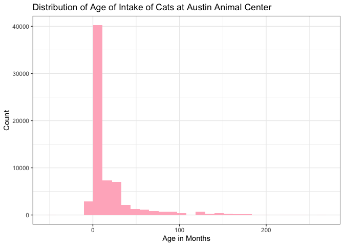

Austin Animal Center Prediction Model
================

# Question being addressed and outcome variable to be predicted:

# We want to address how the cats’ characteristics (breed, sex upon intake, intake type, age in months) predict their intake condition at the Austin Animal Center. Our outcome variable will be the intake condition as a binary variable, either normal or abnormal, such as pregnant, aged or injured. Determining the intake condition of a cat is incredibly important as it can affect how it should be maintained and any special attention the cat may need. Oftentimes, the intake condition of cats is not easily determined due to many unnoticeable aspects such as an internal injury, so utilizing these variables to set up a predictive model based on the known data observations, we can determine rough estimates of cats’ intake condition.

``` r
# Load applicable packages
library(tidyverse)
```

    ## ── Attaching core tidyverse packages ──────────────────────── tidyverse 2.0.0 ──
    ## ✔ dplyr     1.1.4     ✔ readr     2.1.6
    ## ✔ forcats   1.0.1     ✔ stringr   1.6.0
    ## ✔ ggplot2   4.0.1     ✔ tibble    3.3.1
    ## ✔ lubridate 1.9.4     ✔ tidyr     1.3.2
    ## ✔ purrr     1.2.1     
    ## ── Conflicts ────────────────────────────────────────── tidyverse_conflicts() ──
    ## ✖ dplyr::filter() masks stats::filter()
    ## ✖ dplyr::lag()    masks stats::lag()
    ## ℹ Use the conflicted package (<http://conflicted.r-lib.org/>) to force all conflicts to become errors

``` r
library(tidymodels)
```

    ## ── Attaching packages ────────────────────────────────────── tidymodels 1.4.1 ──
    ## ✔ broom        1.0.11     ✔ rsample      1.3.2 
    ## ✔ dials        1.4.3      ✔ tailor       0.1.0 
    ## ✔ infer        1.1.0      ✔ tune         2.0.1 
    ## ✔ modeldata    1.5.1      ✔ workflows    1.3.0 
    ## ✔ parsnip      1.5.0      ✔ workflowsets 1.1.1 
    ## ✔ recipes      1.3.2      ✔ yardstick    1.4.0 
    ## ── Conflicts ───────────────────────────────────────── tidymodels_conflicts() ──
    ## ✖ scales::discard() masks purrr::discard()
    ## ✖ dplyr::filter()   masks stats::filter()
    ## ✖ recipes::fixed()  masks stringr::fixed()
    ## ✖ dplyr::lag()      masks stats::lag()
    ## ✖ yardstick::spec() masks readr::spec()
    ## ✖ recipes::step()   masks stats::step()

``` r
library(readxl)

# Upload Austin Animal Center dataset
set.seed(123)
animals <- read_excel("~/Downloads/projects/AustinAnimalCenter.xlsx")
```

``` r
# Recode animals dataset to only include cats and convert the age upon intake into a common variable of months
animals <- animals |>
 filter(animal_type == "Cat") |>
 mutate(age_num = str_split_i(age_upon_intake, " ", 1)) |>
 mutate(age_unit = str_split_i(age_upon_intake, " ", 2)) |>
 mutate(age_in_months = case_when(
 age_unit == "years" ~ as.numeric(age_num) * 12,
 age_unit == "year" ~ as.numeric(age_num) * 12,
 age_unit == "months" ~ as.numeric(age_num) * 1,
 age_unit == "month" ~ as.numeric(age_num) * 1,
 age_unit == "weeks" ~ as.numeric(age_num) * (7/30.4375),
 age_unit == "week" ~ as.numeric(age_num) * (7/30.4375),
 TRUE ~ NA_real_
 ))
```

``` r
# Graphed the distribution of the age of intake of cats on a histrogram
animals |>
 ggplot(aes(x = age_in_months)) +
 geom_histogram(fill = "pink1") +
 theme_bw() +
 labs(title = "Distribution of Age of Intake of Cats at Austin Animal Center", x = "Age in Months", y = "Count")
```

    ## `stat_bin()` using `bins = 30`. Pick better value `binwidth`.

    ## Warning: Removed 2728 rows containing non-finite outside the scale range
    ## (`stat_bin()`).

<!-- -->

``` r
# Denote all conditions that are not 'Normal' as 'Abnormal'
animals <- animals |>
 filter(intake_condition != "Unknown") |>
 mutate(intake_condition = factor(ifelse(intake_condition == "Normal", "Normal", "Abnormal"))) |>
 mutate(intake_condition = fct_relevel(intake_condition, "Abnormal"))
```

``` r
# Draw a random sample of 50000
animals_sub <- animals |>
  slice_sample(n = 50000)
```

``` r
# Create base prediction model (logistic regression)
# Split the data
set.seed(151)
split <- initial_split(animals_sub, prop = 0.75)
train <- training(split)
test <- testing(split)

# Create the recipe
rec <- train |>
  recipe(intake_condition ~ breed + sex_upon_intake + intake_type + age_in_months)

model <- logistic_reg() |>
  set_engine("glm") |>
  set_mode("classification")

# Create the workflow
wf <- workflow() |>
  add_recipe(rec) |>
  add_model(model)

# Create 10 folds from the dataset
set.seed(101)
folds <- vfold_cv(train, v = 10)

# Run cross validation with the model
set.seed(131)
res <- fit_resamples(wf, resamples = folds)

# Show performance metrics
res |>
 collect_metrics()
```

    ## # A tibble: 3 × 6
    ##   .metric     .estimator  mean     n std_err .config        
    ##   <chr>       <chr>      <dbl> <int>   <dbl> <chr>          
    ## 1 accuracy    binary     0.838    10 0.00202 pre0_mod0_post0
    ## 2 brier_class binary     0.129    10 0.00107 pre0_mod0_post0
    ## 3 roc_auc     binary     0.666    10 0.00480 pre0_mod0_post0

``` r
# The configuration of 'breed', 'sex_upon_intake', and 'age_in_months' produced the best performing model on the training data with accuracy of 0.8359344.
```

``` r
# Create alternate prediction model (K-Nearest Neighbors)
# Create the recipe
rec_knn <- recipe(
 intake_condition ~ breed + sex_upon_intake + intake_type + age_in_months,
 data = train
) |>
 step_impute_mode(all_nominal_predictors()) |>
 step_impute_median(all_numeric_predictors()) |>
 step_novel(all_nominal_predictors()) |>
 step_dummy(all_nominal_predictors()) |>
 step_zv(all_predictors()) |>
 step_normalize(all_predictors())

# Tune neighbors
knn_model <- nearest_neighbor(
 neighbors = tune()
) |>
 set_engine("kknn") |>
 set_mode("classification")

# Compile the workflow
wf_knn <- workflow() |>
 add_recipe(rec_knn) |>
 add_model(knn_model)

# Create 10 folds (stratified)
set.seed(456)
folds1 <- vfold_cv(train, v = 10, strata = intake_condition)

# Create tuning grid
grid_knn <- tibble(neighbors = seq(1, 71, by = 10))

# Fit model to tuning grid
set.seed(181)
knn_tuned <- tune_grid(
 wf_knn,
 resamples = folds1,
 grid = grid_knn,
 metrics = metric_set(accuracy, roc_auc))

# Show performance metrics
knn_tuned |> collect_metrics()
```

    ## # A tibble: 16 × 7
    ##    neighbors .metric  .estimator  mean     n  std_err .config        
    ##        <dbl> <chr>    <chr>      <dbl> <int>    <dbl> <chr>          
    ##  1         1 accuracy binary     0.728    10 0.00390  pre0_mod1_post0
    ##  2         1 roc_auc  binary     0.568    10 0.00276  pre0_mod1_post0
    ##  3        11 accuracy binary     0.815    10 0.00169  pre0_mod2_post0
    ##  4        11 roc_auc  binary     0.664    10 0.00287  pre0_mod2_post0
    ##  5        21 accuracy binary     0.823    10 0.00105  pre0_mod3_post0
    ##  6        21 roc_auc  binary     0.688    10 0.00261  pre0_mod3_post0
    ##  7        31 accuracy binary     0.826    10 0.00132  pre0_mod4_post0
    ##  8        31 roc_auc  binary     0.698    10 0.00338  pre0_mod4_post0
    ##  9        41 accuracy binary     0.827    10 0.00104  pre0_mod5_post0
    ## 10        41 roc_auc  binary     0.704    10 0.00310  pre0_mod5_post0
    ## 11        51 accuracy binary     0.827    10 0.000923 pre0_mod6_post0
    ## 12        51 roc_auc  binary     0.710    10 0.00296  pre0_mod6_post0
    ## 13        61 accuracy binary     0.828    10 0.000920 pre0_mod7_post0
    ## 14        61 roc_auc  binary     0.714    10 0.00334  pre0_mod7_post0
    ## 15        71 accuracy binary     0.829    10 0.000955 pre0_mod8_post0
    ## 16        71 roc_auc  binary     0.717    10 0.00308  pre0_mod8_post0

``` r
# The configuration of ‘breed’, ‘sex_upon_intake’, ‘intake_type’ and ‘age_in_months’ produced the best performing model on the training data with accuracy of 0.8273335. The best number of nearest neighbors is 71.
```

``` r
# Choosing the model that performs the best on our training dataset

# Create the recipe
rec_final <- recipe(
 intake_condition ~ breed + sex_upon_intake + intake_type + age_in_months,
 data = train) |>
  step_novel(all_nominal_predictors()) |>
  step_dummy(all_nominal_predictors())

model_final <- logistic_reg() |>
 set_engine("glm") |>
 set_mode("classification")

# Create the workflow
wf_final <- workflow() |>
 add_recipe(rec_final) |>
 add_model(model_final)

#Fit test data and get test metrics
final_fit <- fit(wf_final, data = train)
test_results <- predict(final_fit, test, type = "prob") |>
 bind_cols(predict(final_fit, test)) |>
 bind_cols(test)
```

    ## Warning in predict.lm(object, newdata, se.fit, scale = 1, type = if (type == :
    ## prediction from rank-deficient fit; attr(*, "non-estim") has doubtful cases
    ## Warning in predict.lm(object, newdata, se.fit, scale = 1, type = if (type == :
    ## prediction from rank-deficient fit; attr(*, "non-estim") has doubtful cases

``` r
test_metrics <- test_results |>
 metrics(truth = intake_condition, estimate = .pred_class)
test_metrics
```

    ## # A tibble: 2 × 3
    ##   .metric  .estimator .estimate
    ##   <chr>    <chr>          <dbl>
    ## 1 accuracy binary        0.836 
    ## 2 kap      binary        0.0374

``` r
# The best model is the logistic regression model. The accuracy for the logistic regression model is 0.83639691.
```
